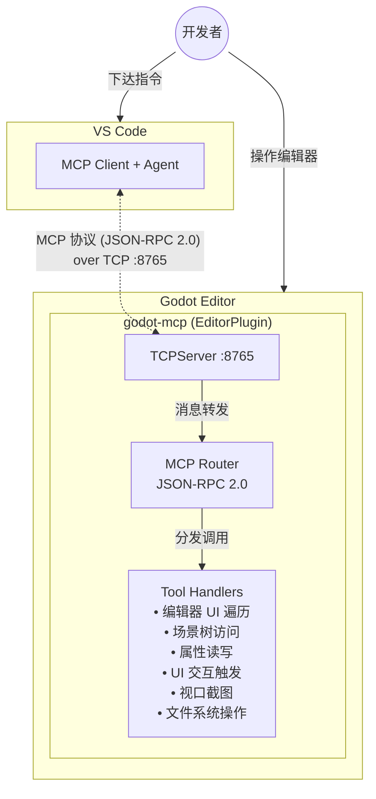

# godot-mcp：Godot 编辑器 MCP Agent 工具

## 需求

构建一个在 **Godot 编辑器内部运行** 的 MCP Server（以 EditorPlugin 形式），使 VS Code Agent 能够直接感知和操作 Godot 编辑器，实现：

- Agent **看到用户看到的**：编辑器布局、场景树、Inspector 属性、视口内容、文件系统等
- Agent **操作用户能操作的**：点击按钮、修改属性、选择节点、打开脚本、运行场景等
- **不硬编码**所有编辑器操作——Agent 通过 MCP 获取编辑器 UI 结构后自主决策，就像人看界面一样
- 在用户当前打开的 Project 中工作

### 典型 Agent 能力场景

| 场景 | 说明 |
|------|------|
| **调试辅助** | Agent 连接到编辑器，查看当前场景树、节点属性、检查问题 |
| **自动化修改** | Agent 根据自然语言指令批量修改节点属性（例如"把这五个按钮的对齐改成居中"） |
| **UI 状态感知** | Agent 读取编辑器 UI 树，知道当前选中什么、Inspector 显示什么 |
| **引导式操作** | Agent 告诉用户下一步点哪里，甚至直接帮用户点击 |
| **测试编写** | Agent 查看场景结构后自动生成对应的 GUT 测试代码 |

---

## 方案分析

### 架构



### 技术选型

| 组件 | 选择 | 理由 |
|------|------|------|
| 插件语言 | **GDScript EditorPlugin** | 完整 EditorInterface API；热加载；零编译 |
| 协议 | **MCP (JSON-RPC 2.0 over TCP)** | Godot 内置 `JSONRPC` 类原生支持；MCP 底层就是 JSON-RPC |
| 传输层 | **TCP**（后续可加 WebSocket） | `TCPServer` 简单可靠；VS Code MCP SDK 原生支持 stdio/tcp |
| 编辑器感知 | **Control 树遍历** + EditorInterface API | 编辑器本身就是 Control 节点树，天然可遍历 |

### 技术选型说明：GDScript Plugin vs GDExtension

| 能力 | GDScript Plugin | GDExtension |
|------|----------------|-------------|
| 启动 TCP 服务器 | ✅ `TCPServer` | ✅ |
| JSON-RPC 消息解析 | ✅ 内置 `JSONRPC` 类 | ✅ |
| 遍历编辑器 UI 树 | ✅ `EditorInterface.get_base_control()` | ✅ |
| 读写属性 | ✅ `Node.set()` / `.get()` | ✅ |
| 操作 EditorInterface | ✅ 完整 API | ✅ |
| 开发体验 | 热加载，复制即用 | 需编译链，部署复杂 |
| 适用场景 | 编辑器工具、MCP Server | 绕过 Godot API 的非常规操作 |

本项目的全部需求均在 GDScript EditorPlugin 的能力范围内。选择 GDScript 的核心理由：
- **热加载开发**：修改代码即时生效，不需要重启编辑器
- **零编译部署**：复制 `addons/` 目录即可分发
- **完整 API 覆盖**：EditorInterface 暴露了所有需要的编辑器能力

---

## 可行性论证

### 依据：Godot 4.6.4-rc 引擎源码调研

调研了 `E:\Projects\GitHub\godot-engine` 源码（v4.6.4-rc，`version.py`），关键结论：

#### 1. 编辑器是 Control 节点树（`editor/editor_interface.h`）

```cpp
// EditorInterface 提供编辑器根 Control（editor/editor_interface.h:122）
Control *get_base_control() const;
// 可递归遍历所有子节点
// 按名称模糊查找
// editor_root->find_child("*Button*", true, false)
```

整个编辑器 UI（菜单栏、场景面板、Inspector、文件系统、底部面板等）都由标准 `Control` 节点构成，Plugin 通过 `get_base_control()` 获取根节点后可完整遍历。

#### 2. EditorPlugin 可启动网络服务

`TCPServer`（`core/io/tcp_server.h`）在 GDScript 中完全可用。Godot 远程调试器本身就用 TCP + JSON-RPC，说明此架构生产可靠。`EditorPlugin` 通过 `_enable_plugin()` / `_disable_plugin()` 管理生命周期。

#### 3. JSON-RPC 协议内置支持（`modules/jsonrpc/jsonrpc.h`）

```cpp
class JSONRPC : public Object {
    GDCLASS(JSONRPC, Object)

    HashMap<String, Callable> methods;

    void set_method(const String &p_name, const Callable &p_callback);
    Variant process_action(const Variant &p_action, bool p_process_arr_elements = false);
    String process_string(const String &p_input);

    Dictionary make_response_error(int p_code, const String &p_message, const Variant &p_id = Variant()) const;
    Dictionary make_response(const Variant &p_value, const Variant &p_id);
    Dictionary make_notification(const String &p_method, const Variant &p_params);
    Dictionary make_request(const String &p_method, const Variant &p_params, const Variant &p_id);
};
```

MCP 协议底层就是 JSON-RPC 2.0，Godot 内置 `JSONRPC` 类可直接用于消息构造和处理。

#### 4. EditorInterface 提供完整 API（`editor/editor_interface.h`，验证于 v4.6.4-rc）

| API | 用途 |
|-----|------|
| `get_edited_scene_root()` | 获取当前编辑场景根节点 |
| `get_selection()` | 获取当前选中节点 |
| `get_inspector()` | 获取 Inspector 引用 |
| `get_base_control()` | 获取编辑器 UI 根 Control |
| `inspect_object(obj)` | 在 Inspector 中显示对象 |
| `edit_node(node)` | 编辑指定节点 |
| `edit_script(script, line)` | 打开脚本到指定行 |
| `play_current_scene()` | 运行当前场景 |
| `get_file_system_dock()` | 获取文件系统面板 |
| `get_editor_undo_redo()` | 获取 EditorUndoRedoManager |

此外还有：
| API | 用途 |
|-----|------|
| `get_editor_viewport_2d()` / `get_editor_viewport_3d()` | 获取 2D/3D 视口 |
| `get_script_editor()` | 获取脚本编辑器引用 |
| `get_selected_paths()` | 获取文件系统中选中的路径 |
| `save_scene()` / `save_all_scenes()` | 场景保存 |
| `stop_playing_scene()` / `is_playing_scene()` | 场景运行控制 |
| `get_open_scenes()` | 获取所有已打开的场景 |

#### 5. EditorSelection 选择管理（`editor/editor_data.h:273`）

```cpp
class EditorSelection : public Object {
    void add_node(Node *p_node);
    void remove_node(Node *p_node);
    bool is_selected(Node *p_node) const;
    void clear();
    TypedArray<Node> get_selected_nodes();
    List<Node *> get_top_selected_node_list();
};
```

通过 `EditorInterface.get_selection()` 获取实例，支持增删节点、查询选中状态、清空选择。

#### 6. GUT 可集成用于测试

GUT（`bitwes/Gut`）通过 `addons/gut/gut_cmdln.gd` 提供 CLI 入口。在 godot-mcp 中可以作为 MCP Tool 暴露：
- `run_tests(gdir, filter)` → 运行 GUT 测试并返回 XML/JSON 结果
- `generate_test(scene_path)` → 分析场景结构，生成测试骨架

### 可行性矩阵

| 需求 | 可行 | 方式 |
|------|------|------|
| 在编辑器内启动 MCP Server | ✅ | `TCPServer` + `JSONRPC` |
| 读取编辑器 UI 结构 | ✅ | `get_base_control()` 遍历 |
| 读取场景树 | ✅ | `get_edited_scene_root()` 递归 |
| 读取 Inspector 当前状态 | ✅ | 遍历 Inspector Control 树 |
| 选中/取消选中节点 | ✅ | `EditorSelection.add_node/clear()` |
| 修改节点属性（可撤销） | ✅ | `EditorUndoRedoManager` |
| 点击编辑器按钮 | ✅ | `button.pressed.emit()` |
| 在输入框填写文本 | ✅ | `line_edit.text = "..."` |
| 打开脚本 | ✅ | `edit_script()` |
| 运行场景 | ✅ | `play_current_scene()` |
| 截图编辑器视口 | ✅ | 2D/3D 视口 `get_texture().get_image()` |
| 文件系统导航 | ✅ | `FileSystemDock` + `get_selected_paths()` |
| 运行 GUT 测试 | ✅ | 通过 `EditorPlugin._run_scene()` 或 CLI 包装 |

---

## 难点与对策

### 1. UI 元素定位可靠性

**难点**：编辑器 UI 的 Control 节点名可能随 Godot 版本变化，硬编码 `find_child("ButtonName")` 不稳定。

**对策**：
- 优先用 **类名 + 文本内容** 定位（如 `find_child("*")` 过滤 `class="Button" && text="Play"`）
- Plugin 在节点上附加 `meta` 标签做标识（`control.set_meta("mcp_role", "play_button")`）
- MCP 返回完整的 UI 树给 Agent，Agent 用 LLM 语义理解自主决定点击哪个元素——不依赖固定路径

### 2. 插件生命周期与端口管理

**难点**：Plugin 启用/禁用时端口需要正确管理，避免端口冲突或残留。

**对策**：
- `_enable_plugin()` → 启动 TCPServer，listen `127.0.0.1:8765`
- `_disable_plugin()` → 停止 TCPServer，close 所有连接
- 支持端口通过 ProjectSettings 配置

### 3. MCP 协议兼容性

**难点**：MCP 是新兴协议，规范可能变化；需要与 VS Code MCP Client 兼容。

**对策**：
- MCP 底层就是 JSON-RPC 2.0，Godot `JSONRPC` 类可以直接处理消息帧
- 实现 `initialize` / `list_tools` / `call_tool` / `list_resources` / `read_resource` 等标准 MCP 方法
- 传输层使用 MCP 标准的 JSON-RPC over TCP（`Content-Length` 头帧格式）

### 4. 安全性

**难点**：MCP Server 暴露在本地端口，可能被其他进程访问。

**对策**：
- 只 bind `127.0.0.1`（localhost），不暴露到外网
- 可选的 token 验证机制
- 提供白名单配置

### 5. 编辑器 UI 可能的状态复杂度

**难点**：编辑器可能有多个 Dock 位置、折叠面板、多窗口等，UI 树状态维度高。

**对策**：
- MCP 返回扁平化摘要（包含名称、类、可见性、关键值），Agent 按需钻取
- Agent 可以多次调用工具逐步深入，不需要一次获取全量信息

### 6. 修改操作的用户确认

**难点**：Agent 自动修改编辑器内容可能导致用户意外。

**对策**：
- 提供 `dry_run` 模式：Agent 先描述要做什么，用户确认后再执行
- 所有修改通过 `EditorUndoRedoManager`，用户可撤销
- 可选的"需要确认"配置项

---

## 竞品调研（GitHub 已有项目）

截至 2026-06-11，GitHub 上有 **30+** 个 Godot MCP 相关仓库，以下为最相关的 7 个：

### 架构模式分类

| 模式 | 代表项目 | 说明 |
|------|---------|------|
| **EditorPlugin 嵌入式** | LuoxuanLove, fernforestgames | MCP Server 作为 EditorPlugin 在编辑器内运行 |
| **EditorPlugin + 外部 Bridge** | MarcuzziFranco, ayutaz | EditorPlugin 通过 TCP/WebSocket 连接外部 MCP Server |
| **外部 CLI 包装** | Coding-Solo, Pushks18 | 纯外部进程，通过命令行启动 Godot |
| **GDExtension (C++)** | MeowMeowZi | 编译为 .dll/.so 的原生插件 |

### 重点竞品详情

#### 1. [LuoxuanLove/godot-dotnet-mcp](https://github.com/LuoxuanLove/godot-dotnet-mcp) ⭐29

| 维度 | 信息 |
|------|------|
| **语言** | GDScript (93.8%) |
| **架构** | GDScript EditorPlugin，内嵌 MCP Server |
| **传输** | **stdio**（由 AI Client 直接启动 Godot） |
| **Godot 版本** | 4.6+ |
| **活跃度** | 🔥 极高（1080 commits，15 releases，最近更新 2 天前） |
| **工具数** | 20+ |
| **特色** | 证据感知上下文、实时游戏验证（CoGDSex）、自包含零依赖 |

**与本文案的关系**：理念最接近——都是 GDScript EditorPlugin。区别在于传输层：LuoxuanLove 用 stdio（AI Client 启动 Godot），本文案用 TCP（编辑器常驻监听）。

#### 2. [IvanMurzak/Godot-MCP](https://github.com/IvanMurzak/Godot-MCP) ⭐4

| 维度 | 信息 |
|------|------|
| **语言** | C# (.NET) |
| **架构** | C# EditorPlugin + 云端后端 / 自托管 |
| **传输** | HTTP + SignalR |
| **Godot 版本** | 4.3+（需 Mono/.NET 构建） |
| **活跃度** | 🔥 极高（v0.4.0 6 小时前发布） |
| **工具数** | **36 个**（分 10 个工具族） |
| **特色** | 反射逃生舱（动态调用任意 C# 方法）、云端 AI 协作 |

**参考价值**：工具分类体系（场景编辑/项目管理/脚本分析/运行时控制/调试/文件系统/编辑器控制/项目设置/资源操作/测试执行）值得借鉴。

#### 3. [MarcuzziFranco/godot-bridge-mcp-public](https://github.com/MarcuzziFranco/godot-bridge-mcp-public) ⭐3

| 维度 | 信息 |
|------|------|
| **语言** | Python + GDScript |
| **架构** | GDScript EditorPlugin + Python MCP Server |
| **传输** | **WebSocket**（内部端口 49631） |
| **Godot 版本** | 4.x |
| **活跃度** | 🟡 不活跃（5 月前更新） |
| **工具数** | 30+ |
| **特色** | 自动生成 `godotbridge_token.txt` 认证、Sprite Sheet 分析 |

**与本文案的关系**：架构最接近本文案的 TCP 模型——EditorPlugin 内部启动 WebSocket Server，外部 MCP Client 连接。但多了一层 Python 进程。

#### 4. [Coding-Solo/godot-mcp](https://github.com/Coding-Solo/godot-mcp) ⭐4,100

| 维度 | 信息 |
|------|------|
| **语言** | JavaScript (Node.js) |
| **架构** | 外部 CLI 包装（`npx godot-mcp`） |
| **传输** | stdio |
| **Godot 版本** | 任意 |
| **活跃度** | 🟡 中等（2 月前更新） |
| **工具数** | 12 |
| **说明** | 最流行的 Godot MCP 项目，但本质是 CLI 启动器，非编辑器集成 |

#### 5. 其他项目一览

| 项目 | ⭐ | 语言 | 特色 |
|------|-----|------|------|
| [ayutaz/godot-loop-mcp](https://github.com/ayutaz/godot-loop-mcp) | 5 | TypeScript | Plugin + 外部 Server + TCP bridge，Godot 4.4+ |
| [fernforestgames/mcp-server-godot-editor](https://github.com/fernforestgames/mcp-server-godot-editor) | 5 | GDScript | 纯 EditorPlugin，8 工具，Godot 4.5+，已 5 月未更新 |
| [MeowMeowZi/meow-godot-mcp](https://github.com/MeowMeowZi/meow-godot-mcp) | 2 | C++ | GDExtension 零依赖方案，50+ 工具，含运行时注入和截图 |

### 本文案的差异化定位

| 维度 | 本文案 | 现有项目 |
|------|--------|---------|
| **语言** | GDScript（纯） | LuoxuanLove 也是，但已占先发 |
| **传输** | TCP（端口可配） | 多数用 stdio，MarcuzziFranco 用 WebSocket |
| **UI 感知** | Control 树完整遍历 + LLM 自主决策 | 多数硬编码 UI 路径 |
| **不硬编码** | Agent 通过 MCP 获取 UI 结构后自主决策 | 多数预定义工具列表 |
| **部署** | 复制到 addons/ 即用 | 多数需要 Node.js/Python/.NET SDK |

**核心差异化**：本文案强调 **Agent 自主 UI 感知**——不预定义"点击播放按钮"的工具，而是返回 UI 树让 LLM 自己判断。这与现有项目的"固定工具列表"模式形成互补。

---

## 记录

| 项目 | 内容 |
|------|------|
| 创建日期 | 2026-06-11 |
| 基于 | Godot Engine v4.6.4-rc 源码 `E:\Projects\GitHub\godot-engine` |
| 验证文件 | `editor/editor_interface.h`, `modules/jsonrpc/jsonrpc.h`, `core/io/tcp_server.h`, `editor/editor_data.h`, `editor/editor_undo_redo_manager.h`, `editor/docks/filesystem_dock.h` |
| 竞品参考 | LuoxuanLove/godot-dotnet-mcp, IvanMurzak/Godot-MCP, MarcuzziFranco/godot-bridge-mcp-public |
| 状态 | 可行性已验证，竞品已调研，待实现 |
